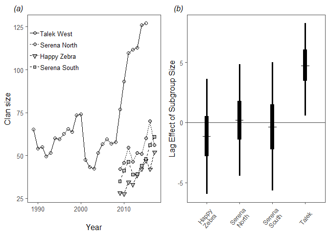

Vignette 1
================

##### Model for vignette 1

``` r
model{

#--------#
#-Priors-#
#--------#

#Intercept
beta0 ~ dnorm(0, 0.1)
#Autoregressive effect
beta1 ~ dnorm(0, 0.1)
#Lag effect of subgroup size @ kills
for(k in 1:nclan){
beta2[k] ~ dnorm(0, 0.1)
}#end k loop
#Random effect of year (time)
for(t in 1:nyrs){
beta3[t] ~ dnorm(0, tau.t)
}#end t loop
tau.t ~ dgamma(0.1, 0.1) #Precision for RE of year
tau.p <- 1/(sig.p*sig.p) #Precision for process variation
sig.p ~ dunif(15, 25) #Process variation
#First year mean clan size
mu[21,1] ~ dunif(15, 35) #Happy Zebra
mu[21,2] ~ dunif(30, 50) #Serena North
mu[21,3] ~ dunif(30, 50) #Serena South
mu[1,4] ~ dunif(50, 70) #Talek West

#------------#
#-Likelihood-#
#------------#

for(i in 1:nobs){
#Normally distributed clan size
clan.size[i] ~ dnorm(mu[yr[i], clan[i]], tau.p)
#Format group size, i, by t,k
gs[yr[i], clan[i]] <- group[i]
}#end i loop
for(k in 1:nclan){
for(t in ns[k]:ne[k]){
#Linear predictor of mean clan size by clan
mu[t,k] <- beta0 +                    #Intercept
               beta1 * mu[t-1,k] +    #Autoregressive effect
               beta2[k] * gs[t-1,k] + #Lag effect of subgroup size @ kills
               beta3[t]               #Random effect of year (time)
}#end t loop
}#end k loop

}
```

Vignette 1 Table S1. JAGS output for the above model.

|            |    mean|    2.5%|   97.5%|     f|
|:-----------|-------:|-------:|-------:|-----:|
| beta0      |    1.22|   -2.89|    5.46|  0.71|
| beta1      |    1.00|    0.93|    1.08|  1.00|
| beta2\[1\] |   -0.40|   -5.30|    4.54|  0.56|
| beta2\[2\] |    1.07|   -3.48|    5.64|  0.68|
| beta2\[3\] |    0.21|   -5.07|    5.40|  0.53|
| beta2\[4\] |    4.89|    1.66|    7.93|  1.00|
| sig.p      |   15.43|   15.01|   16.61|  1.00|
| tau.t      |    2.83|    0.04|   16.63|  1.00|
| deviance   |  413.30|  406.66|  423.37|  1.00|



Figure 3. One year lag effect of mean group size @ kills per year on clan size. There is a 99.73% probability that group size has a positive lag effect on clan size.
