## Temporal and spatial variation in spotted hyena abundance and demography
#### Hyena abundance (clan size) in Talek West has increased in last few decades.

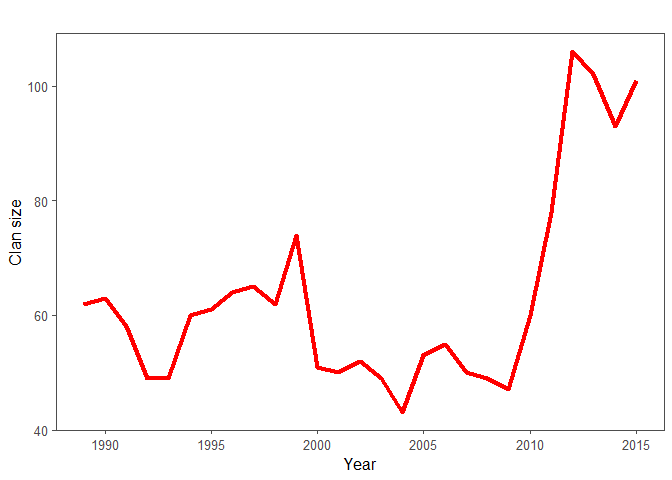<!-- -->

#### Figure 1. Clan size of Talek West between 1989 and 2015.

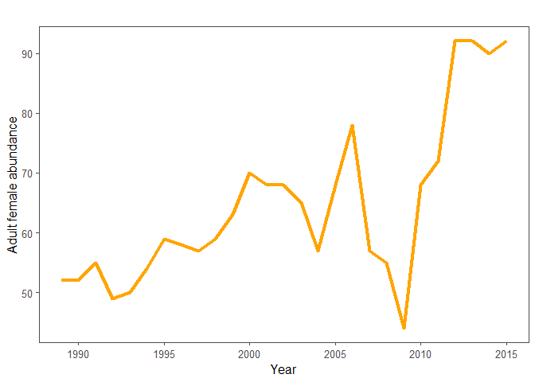<!-- -->

#### Figure 2. Abundance of adult females in Talek West between 1989 and 2015

#### Hyena clans in other areas of the Reserve have had lower clan sizes and population growth rates between 2009 and 2015.

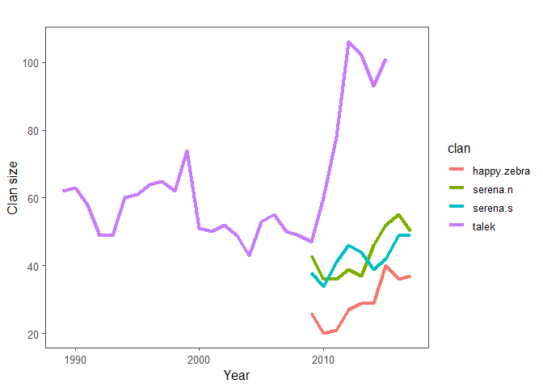<!-- -->

#### Figure 3. Annual clan size of Talek West, Serena North, Serena South, and Happy Zebra.

#### Table 1. Mean growth rate of Talek West, Serena North, Serena South, and Happy Zebra between 2009 and 2015
<table class="table" style="width: auto !important; margin-left: auto; margin-right: auto;">
 <thead>
  <tr>
   <th style="text-align:left;"> clan </th>
   <th style="text-align:right;"> mean growth rate </th>
  </tr>
 </thead>
<tbody>
  <tr>
   <td style="text-align:left;"> happy.zebra </td>
   <td style="text-align:right;"> 1.080457 </td>
  </tr>
  <tr>
   <td style="text-align:left;"> serena.n </td>
   <td style="text-align:right;"> 1.026620 </td>
  </tr>
  <tr>
   <td style="text-align:left;"> serena.s </td>
   <td style="text-align:right;"> 1.042775 </td>
  </tr>
  <tr>
   <td style="text-align:left;"> talek </td>
   <td style="text-align:right;"> 1.130809 </td>
  </tr>
</tbody>
</table>

#### Changes in lion population may be driving these trends. Lions are largest source of hyena mortality (Watts & Holekamp 2008). Lion sightings have declined in Talek West (Green et al. 2018). Lion densities are much lower in Talek West than Mara Triangle (Farr et al. in review).

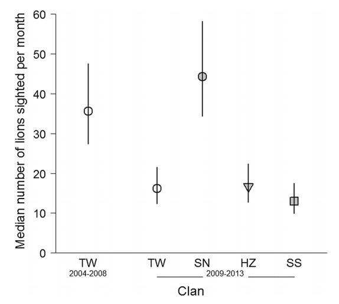

#### Figure 4. Meadian number of lions sighted per month (from Green et al. 2018).

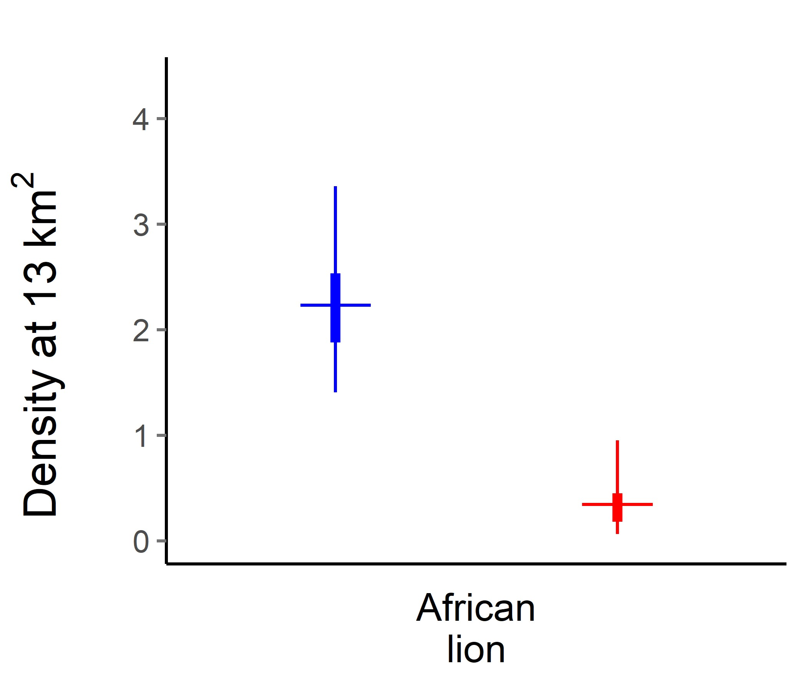

#### Figure 5. Difference in lion densities between Talek West and Mara Triangle (from Farr et al. in review).

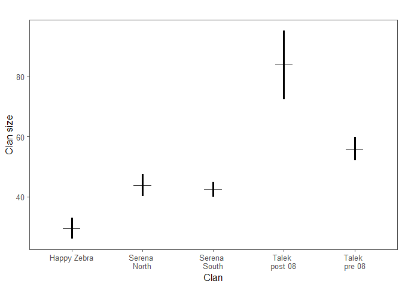<!-- -->

#### Figure 6. Mean clan size (sd) for each clan.

#### Table 2. Mean growth rates for each clan.
<table class="table" style="width: auto !important; margin-left: auto; margin-right: auto;">
 <thead>
  <tr>
   <th style="text-align:left;">   </th>
   <th style="text-align:right;"> Mean Growth Rate </th>
   <th style="text-align:left;"> clan </th>
  </tr>
 </thead>
<tbody>
  <tr>
   <td style="text-align:left;"> 1 </td>
   <td style="text-align:right;"> 1.002218 </td>
   <td style="text-align:left;"> Talek pre 08 </td>
  </tr>
  <tr>
   <td style="text-align:left;"> 5 </td>
   <td style="text-align:right;"> 1.130809 </td>
   <td style="text-align:left;"> Talek post 08 </td>
  </tr>
  <tr>
   <td style="text-align:left;"> 2 </td>
   <td style="text-align:right;"> 1.055923 </td>
   <td style="text-align:left;"> Happy Zebra </td>
  </tr>
  <tr>
   <td style="text-align:left;"> 3 </td>
   <td style="text-align:right;"> 1.003017 </td>
   <td style="text-align:left;"> Serena North </td>
  </tr>
  <tr>
   <td style="text-align:left;"> 4 </td>
   <td style="text-align:right;"> 1.058125 </td>
   <td style="text-align:left;"> Serena South </td>
  </tr>
</tbody>
</table>

## Behavioral links to abundance and demography

### 1) Declines in hyena/lion interactions may be leading to competitive release causing boost in Talek West clan size (Green et al. 2018). 

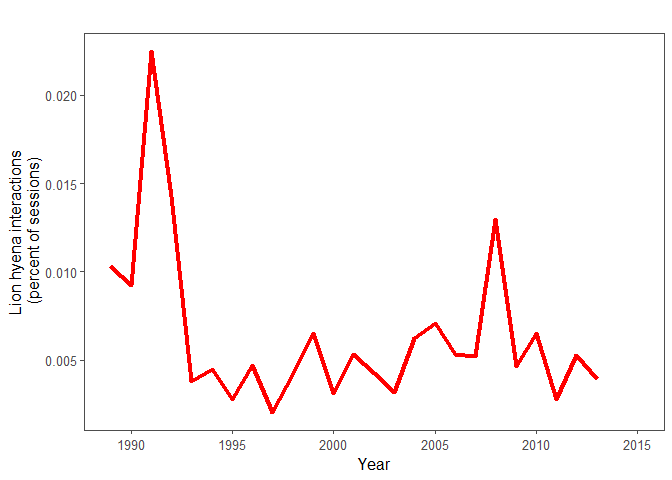<!-- -->

#### Figure 7. Lion and hyena interactions as percent of sessions per year.

#### Correlated but not predictive in linear model.

#### Table 3. Parameter estimates for effect of lion/hyena interaction on clan size.
<table class="table" style="width: auto !important; margin-left: auto; margin-right: auto;">
 <thead>
  <tr>
   <th style="text-align:left;">   </th>
   <th style="text-align:right;"> mean </th>
   <th style="text-align:right;"> 2.5% </th>
   <th style="text-align:right;"> 97.5% </th>
   <th style="text-align:right;"> f </th>
  </tr>
 </thead>
<tbody>
  <tr>
   <td style="text-align:left;"> beta0 </td>
   <td style="text-align:right;"> 4.16 </td>
   <td style="text-align:right;"> -2.26 </td>
   <td style="text-align:right;"> 10.62 </td>
   <td style="text-align:right;"> 0.90 </td>
  </tr>
  <tr>
   <td style="text-align:left;"> beta1 </td>
   <td style="text-align:right;"> -0.13 </td>
   <td style="text-align:right;"> -6.14 </td>
   <td style="text-align:right;"> 6.00 </td>
   <td style="text-align:right;"> 0.52 </td>
  </tr>
  <tr>
   <td style="text-align:left;"> deviance </td>
   <td style="text-align:right;"> 275.25 </td>
   <td style="text-align:right;"> 269.39 </td>
   <td style="text-align:right;"> 281.19 </td>
   <td style="text-align:right;"> 1.00 </td>
  </tr>
</tbody>
</table>

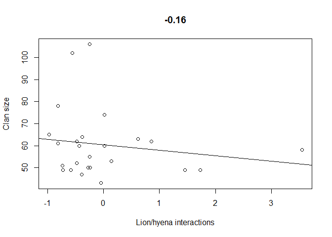<!-- -->

#### Figure 8. Correlation between clan size and lion/hyena interactions.

#### Table 4. Parameter estimates for effect of lion/hyena interaction on adult female abundance.
<table class="table" style="width: auto !important; margin-left: auto; margin-right: auto;">
 <thead>
  <tr>
   <th style="text-align:left;">   </th>
   <th style="text-align:right;"> mean </th>
   <th style="text-align:right;"> 2.5% </th>
   <th style="text-align:right;"> 97.5% </th>
   <th style="text-align:right;"> f </th>
  </tr>
 </thead>
<tbody>
  <tr>
   <td style="text-align:left;"> beta0 </td>
   <td style="text-align:right;"> 4.18 </td>
   <td style="text-align:right;"> -2.24 </td>
   <td style="text-align:right;"> 10.55 </td>
   <td style="text-align:right;"> 0.90 </td>
  </tr>
  <tr>
   <td style="text-align:left;"> beta1 </td>
   <td style="text-align:right;"> -0.26 </td>
   <td style="text-align:right;"> -6.26 </td>
   <td style="text-align:right;"> 5.82 </td>
   <td style="text-align:right;"> 0.53 </td>
  </tr>
  <tr>
   <td style="text-align:left;"> deviance </td>
   <td style="text-align:right;"> 276.19 </td>
   <td style="text-align:right;"> 270.42 </td>
   <td style="text-align:right;"> 282.31 </td>
   <td style="text-align:right;"> 1.00 </td>
  </tr>
</tbody>
</table>

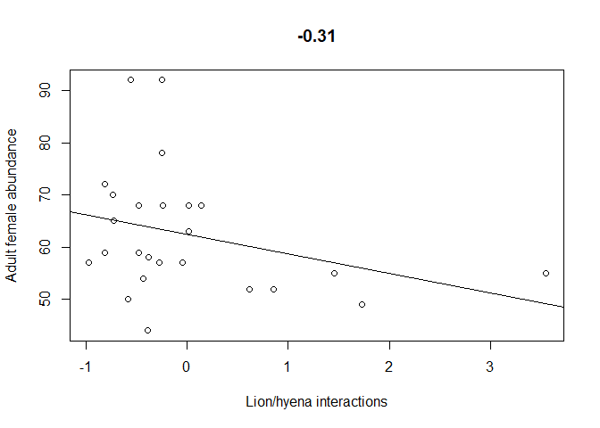<!-- -->

#### Figure 9. Correlation between adult female abundance and lion/hyena interactions.

### 2) Group size long-term trends. 

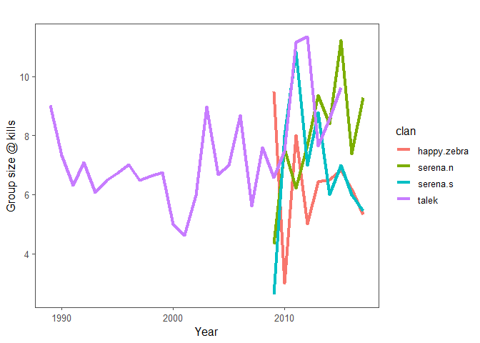<!-- -->

#### Figure 10. Average group size @ kills per year for each clan.

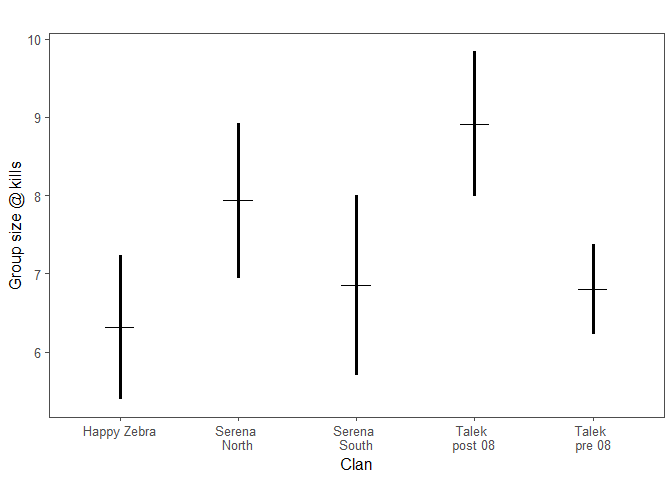<!-- -->

#### Figure 11. Mean and sd of average group size @ kills per year for each clan.

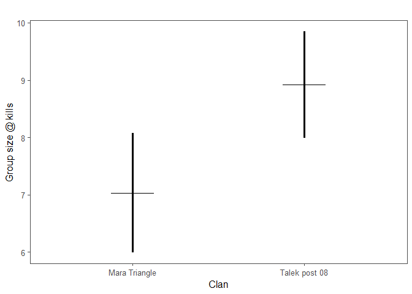<!-- -->

#### Figure 12. Mean and sd of average group size @ kills per year. Comparison of Mara triangle and Talek post 08.

#### Group size of previous year indicative of clan size of current year in Talek, but not in other clans

#### Table 5. Parameter estimates for effect of group size @ kills on clan size
<table class="table" style="width: auto !important; margin-left: auto; margin-right: auto;">
 <thead>
  <tr>
   <th style="text-align:left;">   </th>
   <th style="text-align:right;"> mean </th>
   <th style="text-align:right;"> 2.5% </th>
   <th style="text-align:right;"> 97.5% </th>
   <th style="text-align:right;"> f </th>
  </tr>
 </thead>
<tbody>
  <tr>
   <td style="text-align:left;"> beta0 </td>
   <td style="text-align:right;"> -0.59 </td>
   <td style="text-align:right;"> -3.91 </td>
   <td style="text-align:right;"> 3.04 </td>
   <td style="text-align:right;"> 0.65 </td>
  </tr>
  <tr>
   <td style="text-align:left;"> beta1 </td>
   <td style="text-align:right;"> 1.05 </td>
   <td style="text-align:right;"> 0.99 </td>
   <td style="text-align:right;"> 1.11 </td>
   <td style="text-align:right;"> 1.00 </td>
  </tr>
  <tr>
   <td style="text-align:left;"> beta2[1] </td>
   <td style="text-align:right;"> 0.54 </td>
   <td style="text-align:right;"> -2.36 </td>
   <td style="text-align:right;"> 3.51 </td>
   <td style="text-align:right;"> 0.65 </td>
  </tr>
  <tr>
   <td style="text-align:left;"> beta2[2] </td>
   <td style="text-align:right;"> -0.21 </td>
   <td style="text-align:right;"> -5.70 </td>
   <td style="text-align:right;"> 5.22 </td>
   <td style="text-align:right;"> 0.53 </td>
  </tr>
  <tr>
   <td style="text-align:left;"> beta2[3] </td>
   <td style="text-align:right;"> -0.56 </td>
   <td style="text-align:right;"> -5.82 </td>
   <td style="text-align:right;"> 4.74 </td>
   <td style="text-align:right;"> 0.58 </td>
  </tr>
  <tr>
   <td style="text-align:left;"> beta2[4] </td>
   <td style="text-align:right;"> 1.94 </td>
   <td style="text-align:right;"> -1.18 </td>
   <td style="text-align:right;"> 4.56 </td>
   <td style="text-align:right;"> 0.91 </td>
  </tr>
  <tr>
   <td style="text-align:left;"> sig.p </td>
   <td style="text-align:right;"> 15.51 </td>
   <td style="text-align:right;"> 15.01 </td>
   <td style="text-align:right;"> 16.89 </td>
   <td style="text-align:right;"> 1.00 </td>
  </tr>
  <tr>
   <td style="text-align:left;"> tau.t </td>
   <td style="text-align:right;"> 1.89 </td>
   <td style="text-align:right;"> 0.02 </td>
   <td style="text-align:right;"> 13.97 </td>
   <td style="text-align:right;"> 1.00 </td>
  </tr>
  <tr>
   <td style="text-align:left;"> deviance </td>
   <td style="text-align:right;"> 418.87 </td>
   <td style="text-align:right;"> 409.98 </td>
   <td style="text-align:right;"> 430.46 </td>
   <td style="text-align:right;"> 1.00 </td>
  </tr>
</tbody>
</table>

#### Table 6. Parameter estimates for effect of group size @ kills on adult female abundance
<table class="table" style="width: auto !important; margin-left: auto; margin-right: auto;">
 <thead>
  <tr>
   <th style="text-align:left;">   </th>
   <th style="text-align:right;"> mean </th>
   <th style="text-align:right;"> 2.5% </th>
   <th style="text-align:right;"> 97.5% </th>
   <th style="text-align:right;"> f </th>
  </tr>
 </thead>
<tbody>
  <tr>
   <td style="text-align:left;"> beta0 </td>
   <td style="text-align:right;"> -0.69 </td>
   <td style="text-align:right;"> -4.82 </td>
   <td style="text-align:right;"> 3.47 </td>
   <td style="text-align:right;"> 0.61 </td>
  </tr>
  <tr>
   <td style="text-align:left;"> beta1 </td>
   <td style="text-align:right;"> 1.04 </td>
   <td style="text-align:right;"> 0.96 </td>
   <td style="text-align:right;"> 1.13 </td>
   <td style="text-align:right;"> 1.00 </td>
  </tr>
  <tr>
   <td style="text-align:left;"> beta2[1] </td>
   <td style="text-align:right;"> 0.68 </td>
   <td style="text-align:right;"> -2.30 </td>
   <td style="text-align:right;"> 3.72 </td>
   <td style="text-align:right;"> 0.67 </td>
  </tr>
  <tr>
   <td style="text-align:left;"> beta2[2] </td>
   <td style="text-align:right;"> -0.01 </td>
   <td style="text-align:right;"> -5.45 </td>
   <td style="text-align:right;"> 5.42 </td>
   <td style="text-align:right;"> 0.50 </td>
  </tr>
  <tr>
   <td style="text-align:left;"> beta2[3] </td>
   <td style="text-align:right;"> 0.01 </td>
   <td style="text-align:right;"> -5.37 </td>
   <td style="text-align:right;"> 5.27 </td>
   <td style="text-align:right;"> 0.50 </td>
  </tr>
  <tr>
   <td style="text-align:left;"> beta2[4] </td>
   <td style="text-align:right;"> 1.13 </td>
   <td style="text-align:right;"> -1.78 </td>
   <td style="text-align:right;"> 4.20 </td>
   <td style="text-align:right;"> 0.78 </td>
  </tr>
  <tr>
   <td style="text-align:left;"> sig.p </td>
   <td style="text-align:right;"> 15.41 </td>
   <td style="text-align:right;"> 15.01 </td>
   <td style="text-align:right;"> 16.49 </td>
   <td style="text-align:right;"> 1.00 </td>
  </tr>
  <tr>
   <td style="text-align:left;"> tau.t </td>
   <td style="text-align:right;"> 3.46 </td>
   <td style="text-align:right;"> 0.07 </td>
   <td style="text-align:right;"> 18.52 </td>
   <td style="text-align:right;"> 1.00 </td>
  </tr>
  <tr>
   <td style="text-align:left;"> deviance </td>
   <td style="text-align:right;"> 411.50 </td>
   <td style="text-align:right;"> 404.27 </td>
   <td style="text-align:right;"> 422.64 </td>
   <td style="text-align:right;"> 1.00 </td>
  </tr>
</tbody>
</table>

### 3) Sub-adult behavior linked to population growth rate in Talek West. Sub-adults are largest driver of population growth rate in Talek West.

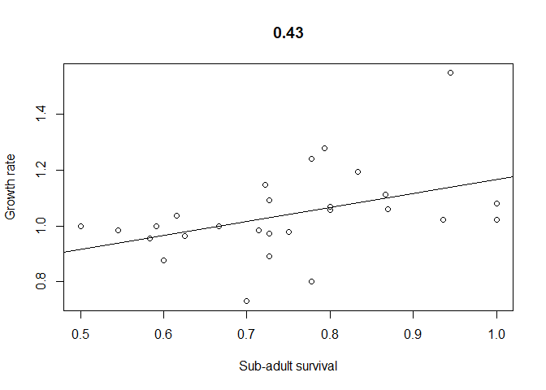<!-- -->

#### Figure 12. Correlation between sub-adult survival and growth rate.

#### Table 7. Parameter estimates for sub social partners predicting growth rate
<table class="table" style="width: auto !important; margin-left: auto; margin-right: auto;">
 <thead>
  <tr>
   <th style="text-align:left;">   </th>
   <th style="text-align:right;"> mean </th>
   <th style="text-align:right;"> 2.5% </th>
   <th style="text-align:right;"> 97.5% </th>
   <th style="text-align:right;"> f </th>
  </tr>
 </thead>
<tbody>
  <tr>
   <td style="text-align:left;"> beta0 </td>
   <td style="text-align:right;"> 1.04 </td>
   <td style="text-align:right;"> 0.97 </td>
   <td style="text-align:right;"> 1.11 </td>
   <td style="text-align:right;"> 1.00 </td>
  </tr>
  <tr>
   <td style="text-align:left;"> beta1 </td>
   <td style="text-align:right;"> 0.06 </td>
   <td style="text-align:right;"> 0.00 </td>
   <td style="text-align:right;"> 0.13 </td>
   <td style="text-align:right;"> 0.97 </td>
  </tr>
  <tr>
   <td style="text-align:left;"> deviance </td>
   <td style="text-align:right;"> -24.99 </td>
   <td style="text-align:right;"> -29.42 </td>
   <td style="text-align:right;"> -16.22 </td>
   <td style="text-align:right;"> 1.00 </td>
  </tr>
</tbody>
</table>

#### Table 8. Parameter estimates for sub social partners predicting sub-adult survival
<table class="table" style="width: auto !important; margin-left: auto; margin-right: auto;">
 <thead>
  <tr>
   <th style="text-align:left;">   </th>
   <th style="text-align:right;"> mean </th>
   <th style="text-align:right;"> 2.5% </th>
   <th style="text-align:right;"> 97.5% </th>
   <th style="text-align:right;"> f </th>
  </tr>
 </thead>
<tbody>
  <tr>
   <td style="text-align:left;"> beta0 </td>
   <td style="text-align:right;"> 0.75 </td>
   <td style="text-align:right;"> 0.68 </td>
   <td style="text-align:right;"> 0.81 </td>
   <td style="text-align:right;"> 1.00 </td>
  </tr>
  <tr>
   <td style="text-align:left;"> beta1 </td>
   <td style="text-align:right;"> 0.02 </td>
   <td style="text-align:right;"> -0.04 </td>
   <td style="text-align:right;"> 0.09 </td>
   <td style="text-align:right;"> 0.75 </td>
  </tr>
  <tr>
   <td style="text-align:left;"> deviance </td>
   <td style="text-align:right;"> -28.44 </td>
   <td style="text-align:right;"> -33.18 </td>
   <td style="text-align:right;"> -19.58 </td>
   <td style="text-align:right;"> 1.00 </td>
  </tr>
</tbody>
</table>

### 4) What is the relation between group sizes and other members of the community.

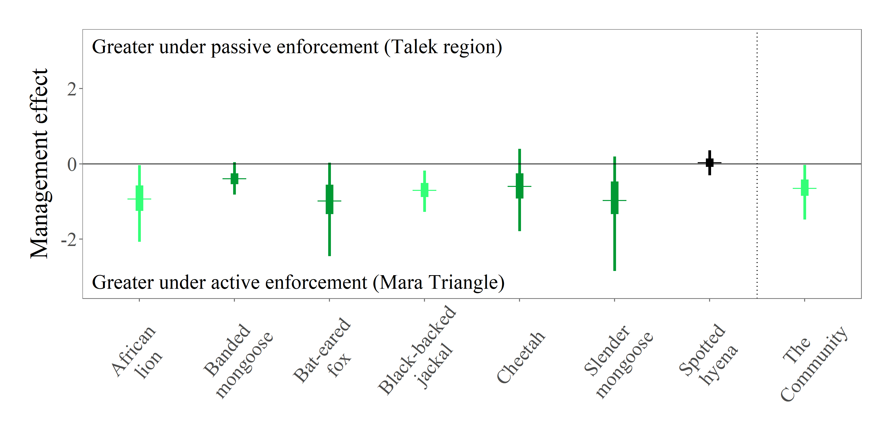

#### Figure 13. Group sizes of carnivores between Talek and Mara Triangle (from Farr et al. in review).

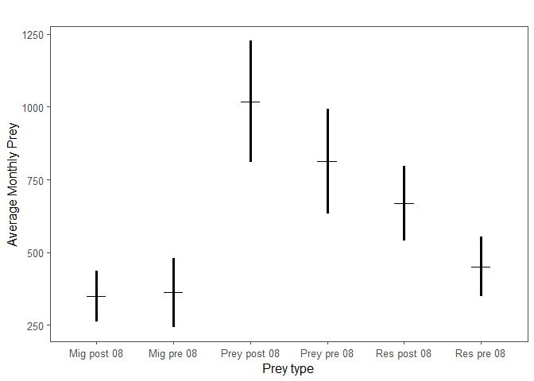<!-- -->

#### Figure 14. Mean and sd of average monthly numbers for each prey type. Comparison of pre and post 08.

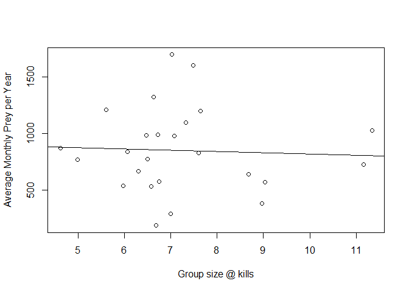<!-- -->

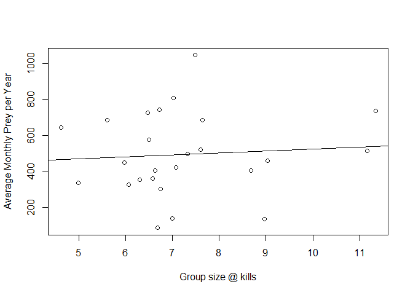<!-- -->

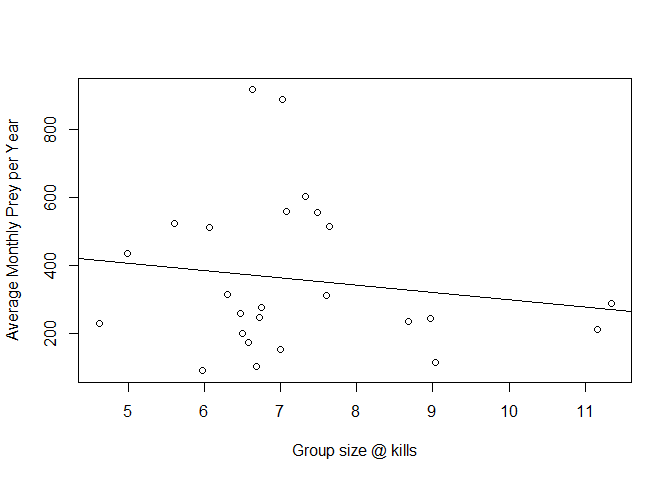<!-- -->
