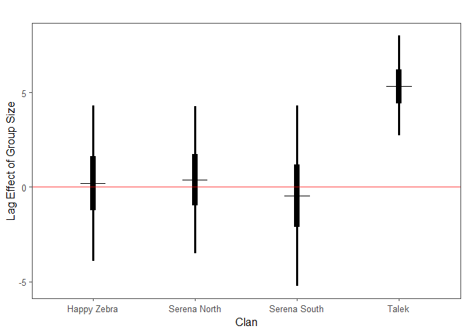
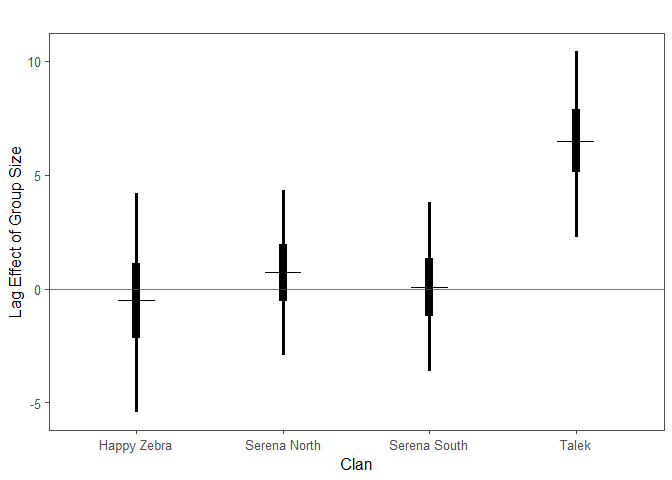
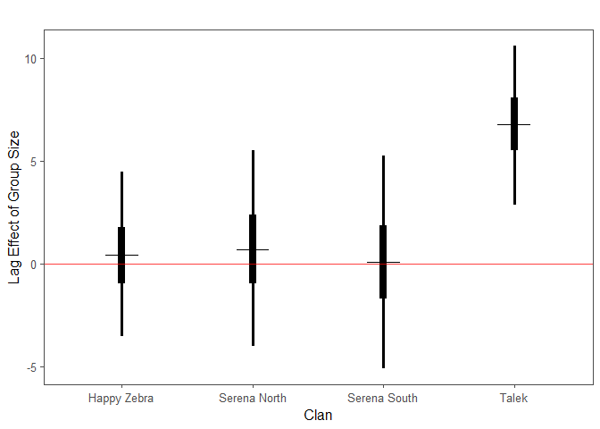
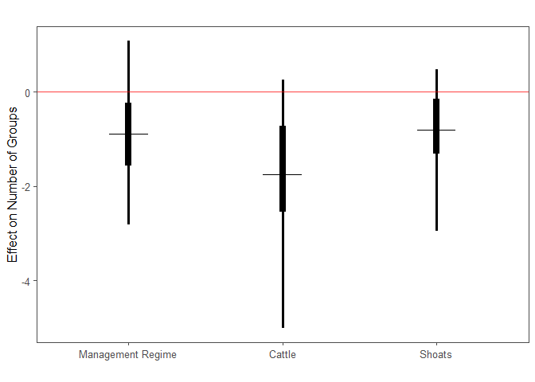
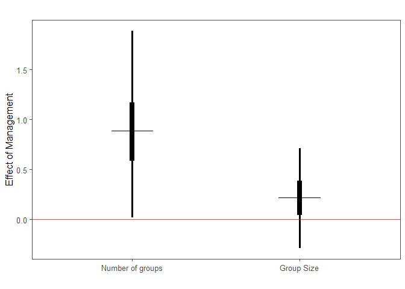
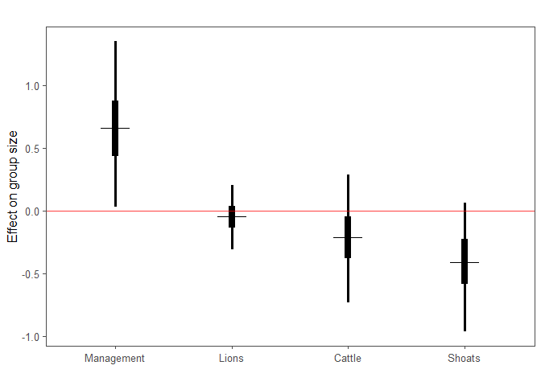

### Group size of previous year indicative of clan size of current year

<!-- -->

Figure 1. One year lag effect of mean group size @ sessions per year on clan size. There is a 90.96% probability that group size has a positive lag effect on clan size.

<!-- -->

Figure 2. One year lag effect of mean group size @ kills per year on clan size. There is a 100% probability that group size has a positive lag effect on clan size.

<!-- -->

Figure 3. One year lag effect of mean group size @ kills per year during the migration on clan size. There is a 99.8% probability that group size has a positive lag effect on clan size.

<!-- -->

Figure 4. One year lag effect of mean group size @ kills per year not during the migration on clan size. There is a 99.93% probability that group size has a positive lag effect on clan size.

### Analyses of group size using distance sampling loops

#### Management regime, cattle, and shoats, negatively affect number of lion groups.

<!-- -->

Figure 5. Effect of management regime, cattle, and shoats on number of lion groups.

#### Talek region has higher number of hyena groups and group size.

<!-- -->

Figure 6. Effect of management regime on number of hyena groups and hyena group size. There is a 97.71% probability that there are higher number of groups in the Talek region, and there is a 97.71% probability of higher group size in the Talek region.

#### Management regime has a positive effect on group size, but lions, cattle, and shoats have a negative effect on group size

<!-- -->

Figure 7. Effect of management regime, cattle, shoats, and lions on hyena group size.
